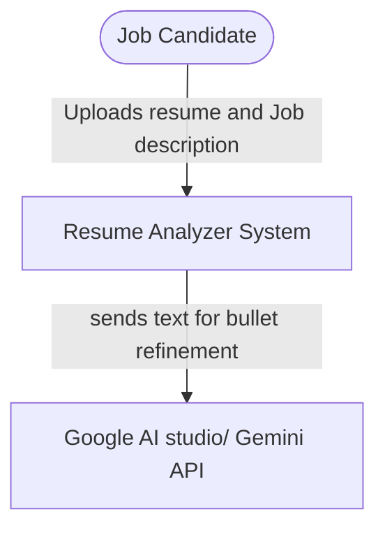
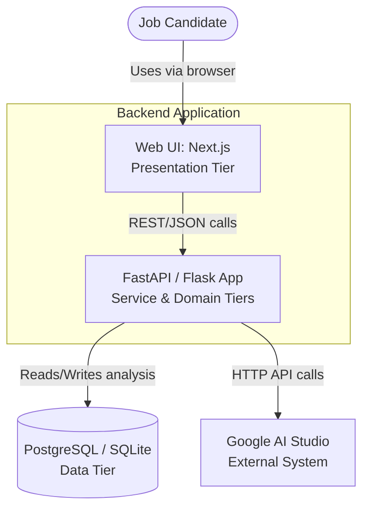
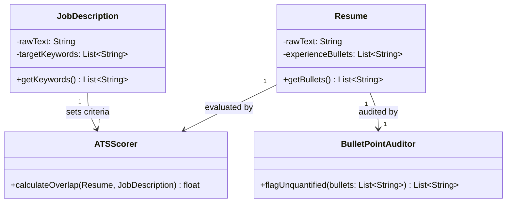
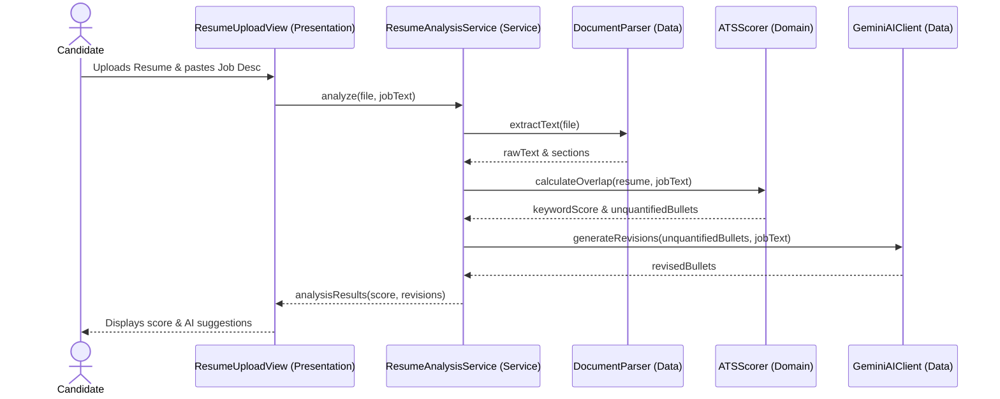

# [AI-Powered Resume Optimizer & ATS Matcher]

<!-- CI badge: after Session 4, replace ORG/REPO and the workflow filename, then uncomment:

-->

**Student:** [Monisha Kummari] · **Course:** CEN 5064 Software Design, Fall 2026 · **Partner:** [@DavLien]

## Project (approval paragraph — write this by Sun Aug 30)

[One paragraph: What is the system? Who is it for? What are its 3–4 core features?
This paragraph is your approval request — see the Project Brief, Section 2.]

An interactive full-stack web application designed to evaluate and optimize candidate resumes against specific job descriptions. Users upload a resume (PDF/DOCX) and paste a target job posting to receive immediate analysis and AI-assisted improvements. Rather than relying solely on external API calls, the system executes custom, deterministic domain logic such as calculating rule-based keyword match percentages, enforcing section structure validations, and flagging unquantified bullet points before invoking AI. Gemini 1.5 Pro is used directly via Google AI Studio as the single external AI service to generate section bullet revisions and tailored cover letter drafts grounded in the candidate's background. 

Core Features: 
1. Automated Document Parsing & Visualizer: Extracts raw text and structural sections (Education, Experience, Skills) locally from uploaded PDF/DOCX files and displays a side-by-side parsed preview.
2. Deterministic Resume Audit & ATS Keyword Analysis: Evaluates resumes using custom internal domain rules—calculating exact keyword overlap scores, flagging bullet points missing quantified metrics, and identifying structural format gaps without needing external APIs.
3. AI Bullet Point Refinement: Direct API integration with Gemini 1.5 Pro to suggest high-impact, quantified bullet point rewrites specifically tailored to key job requirements.
4. Tailored Draft Generation: Generates customized cover letter drafts grounded in the candidate’s extracted experience and target job requirements. 

Tech Stack: 
1. Frontend: React / Next.js (Simple UI with file drag-and-drop & score visualizer)
2. Backend: Python (FastAPI / Flask) running lightweight synchronous processing
3. AI Integration: Google AI Studio (Gemini 1.5 Pro direct API call single external service)
4. Database: PostgreSQL (or SQLite for simple local development)

## How to run

```
[Exact commands to build and run your system from a clean clone.
Update this every time the steps change — your partner and your
instructor will follow it literally on conference days.]
```

## Architecture

### Tier breakdown (Session 2 studio)

| Tier | Responsibilities in THIS system | Class 
|------|--------------------------------|
| Presentation | ResumeUploadView - Manages the drag-and-drop UI and client-side file validation. ScoreVisualizer - Renders the calculated ATS keyword overlap and audit results. JobDescriptionForm - Collects and sanitizes the target job posting text. |
| Service | ResumeAnalysisService - Orchestrates the flow of parsing the resume, running domain audits, and returning the complete analysis. CoverLetterService - Coordinates passing parsed data and job requirements to the AI client to generate drafts.|
| Domain | Resume - Represents the candidate's extracted data and guards its own state. ATSScorer - Calculates the deterministic keyword overlap percentage. BulletPointAuditor - Evaluates experience bullets to flag missing quantified metrics.|
| Data | DocumentParser - Extracts raw text and structural sections from uploaded PDF/DOCX files. GeminiAIClient - Handles the direct HTTP network calls to Google AI Studio. ResumeRepository - Manages saving and loading analysis results to the database.|

### C4 — Context & Container (Session 3 studio)





### UML — Class & Sequence (Session 3 studio)





## Architecture Decision Records

Decisions live in [`docs/adr/`](docs/adr/). Start with ADR-001 in Session 4.

| # | Decision | Status |
|---|----------|--------|
| [001](docs/adr/adr-001.md) | [What I am building and why] | [proposed] |

## Weekly log (optional but recommended)

A one-line note per week keeps your commit story readable:

- Week 1 (Aug 24): repo created, three ideas drafted
- Week 2 (Aug 31): ...
