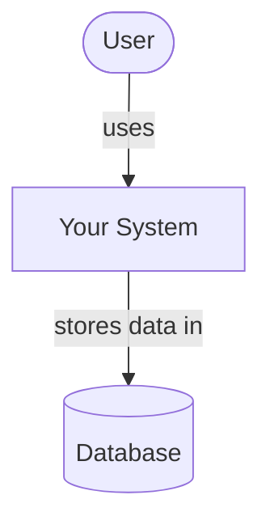
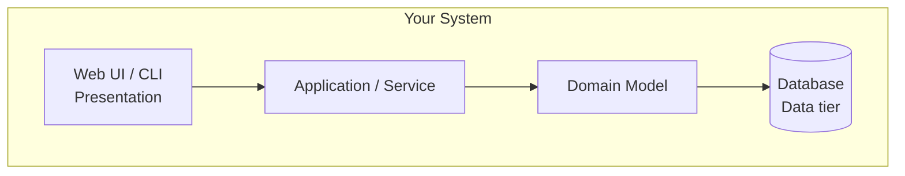
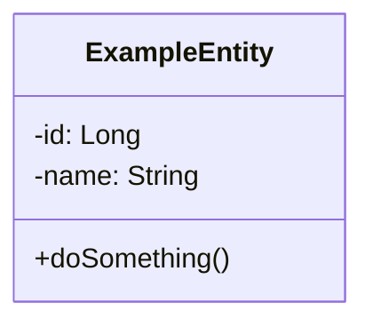
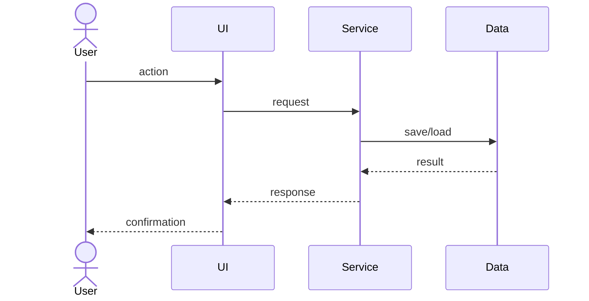

# [AI-Powered Resume Optimizer & ATS Matcher]

<!-- CI badge: after Session 4, replace ORG/REPO and the workflow filename, then uncomment:

-->

**Student:** [Monisha Kummari] · **Course:** CEN 5064 Software Design, Fall 2026 · **Partner:** [@DavLien]

## Project (approval paragraph — write this by Sun Aug 30)

[One paragraph: What is the system? Who is it for? What are its 3–4 core features?
This paragraph is your approval request — see the Project Brief, Section 2.]

An interactive web platform designed to help job seekers optimize their resumes for Applicant Tracking Systems (ATS) and specific job postings. Users upload a draft resume (PDF/Docx) and paste a target job description to receive instant evaluation metrics. The system parses the document, runs asynchronous keyword and semantic gap analysis, and uses Gemini 1.5 Pro to generate actionable, section-by-section bullet point revisions and tailored cover letters.

Core Features:
1.Automated Document Parsing & Parsing Visualizer: Extracts text and structural sections from uploaded resume formats.
2.ATS Compatibility & Keyword Gap Analysis: Computes real-time keyword alignment and semantic relevance scores against the provided job description.
3.AI Bullet Point Refinement: Utilizes Gemini 1.5 Pro via Google AI Studio API to suggest high-impact, quantified resume bullet updates tailored to key job requirements.
4.Tailored Draft Generation: Generates customized cover letter drafts directly grounded in the candidate's existing background and target role requirements.

Tech Stack:
1.Frontend: React / Next.js (Simple UI with file drag-and-drop & score visualizer)
2.Backend: Python (FastAPI / Flask)
3.AI / Orchestration: Gemini 1.5 Pro API via Google AI Studio, LangChain/LlamaIndex
4.Database & Queue: PostgreSQL, Redis/Celery (for handling asynchronous parsing tasks)

## How to run

```
[Exact commands to build and run your system from a clean clone.
Update this every time the steps change — your partner and your
instructor will follow it literally on conference days.]
```

## Architecture

### Tier breakdown (Session 2 studio)

| Tier | Responsibilities in THIS system |
|------|--------------------------------|
| Presentation | [what your UI layer does] |
| Service | [what your use-case/orchestration layer does] |
| Domain | [your entities and business rules] |
| Data | [how and where data is stored] |

### C4 — Context & Container (Session 3 studio)





### UML — Class & Sequence (Session 3 studio)





## Architecture Decision Records

Decisions live in [`docs/adr/`](docs/adr/). Start with ADR-001 in Session 4.

| # | Decision | Status |
|---|----------|--------|
| [001](docs/adr/adr-001.md) | [What I am building and why] | [proposed] |

## Weekly log (optional but recommended)

A one-line note per week keeps your commit story readable:

- Week 1 (Aug 24): repo created, three ideas drafted
- Week 2 (Aug 31): ...
